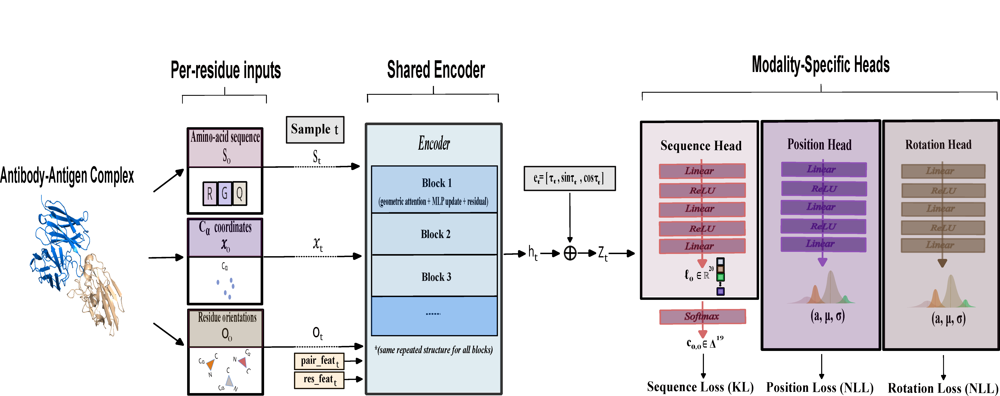

# MDMAD 
**Mixture Diffusion Model for Multimodal Antibody Design**



---

## Installation

### Environment Setup

Create and activate the conda environment:

```bash
conda env create -f env.yaml -n mdmad
conda activate mdmad
```

**Note:** Configure your toolkit version in [`env.yaml`](./env.yaml) before installation.

### Datasets and Trained Weights

**SAbDab Dataset:**
- Download protein structures from the [SAbDab archive](https://opig.stats.ox.ac.uk/webapps/newsabdab/sabdab/archive/all/)
- Extract `all_structures.zip` into the `data` folder
- Use the .tsv in the `data` folder

**Model Weights:**  
Trained model weights are available for download [here](https://drive.google.com/drive/folders/1a7MiL8nnFa3qYr_GINZ6TlVF3iw6gfFC?usp=sharing).


### PyRosetta

PyRosetta is required for relaxing generated structures and computing binding energy.

- Follow the [installation instructions](https://www.pyrosetta.org/downloads)

### Ray

Ray is required for relaxation and evaluation of generated antibodies.

```bash
pip install -U ray
```

---

## Training

Train MDMAD with example configuration (Kx = 1, Ko = 1):

```bash
python train.py ./configs/train/mdmad_k1_k1.yml
```

---

## Sampling

Generate antibodies using the trained model (example for Kx = 1, Ko = 1):

1. Configure the checkpoint file path in `./configs/test/mdmad_k1_k1.yml`
2. Configure the bash file (`run_mass_generation_mdmad_k1_k1.sh`)
3. Run the generation script:

```bash
chmod +x run_mass_generation_mdmad_k1_k1.sh
./run_mass_generation_mdmad_k1_k1.sh
```

---

## Evaluation

Evaluate the generated antibodies:

```bash
python -m mdmad.tools.eval
```

---
